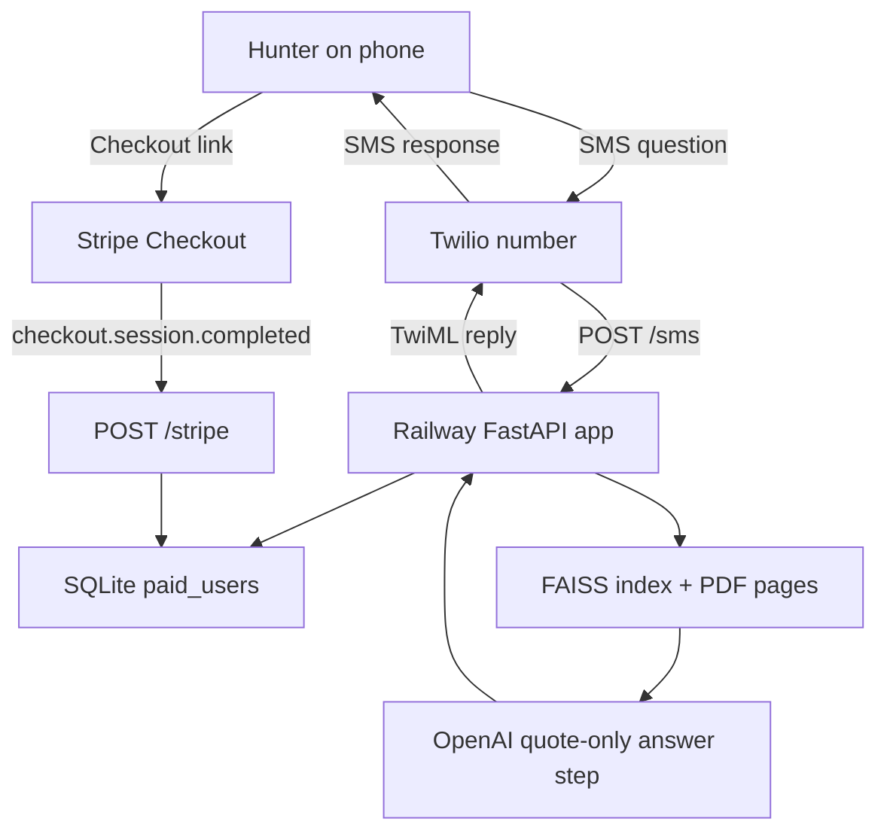
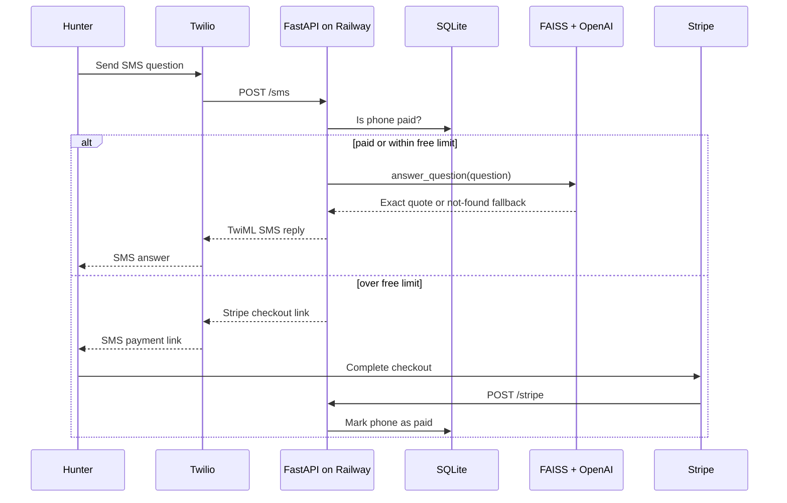

# Ontario Regs Text Architecture

## Purpose

Ontario Regs Text is a production SMS service that answers Ontario hunting regulation questions using only the 2026 Ontario Hunting Regulations Summary PDF.

The bot is designed to:

- accept inbound SMS via Twilio
- check whether the phone number is paid
- answer using quote-only retrieval from the PDF
- fail closed to a safe fallback when no exact answer is found or an internal dependency fails
- mark users as paid after a successful Stripe Checkout event

## High-level components

- `FastAPI app`
  Handles HTTP endpoints for Twilio, Stripe, health checks, and simple success/cancel pages.
- `Twilio`
  Receives customer SMS messages and forwards them to the app's `/sms` webhook.
- `Stripe Checkout`
  Collects payment for the yearly subscription and notifies the app through `/stripe`.
- `RAG layer`
  Loads the Ontario PDF, stores page-level embeddings in FAISS, retrieves relevant pages, and asks OpenAI to return exact quoted text only.
- `SQLite`
  Stores paid phone numbers.
- `Railway`
  Hosts the app and exposes a public URL for Twilio and Stripe webhooks.

## File map

- `app/main.py`
  Main FastAPI app and request routing.
- `app/rag.py`
  PDF parsing, FAISS loading/building, retrieval, and answer generation.
- `app/db.py`
  SQLite setup and paid-user lookup/write logic.
- `app/stripe.py`
  Stripe Checkout session creation and webhook verification.
- `tests/simulate_sms.py`
  Local SMS simulation without live Twilio or live OpenAI calls.
- `data/2026-ontario-hunting-regulations-summary.pdf`
  Source document.
- `data/index.faiss`
  Vector index.
- `data/index.pkl`
  FAISS metadata sidecar.

## System diagram



## Main runtime flow



## Request flow

### 1. Customer sends an SMS

1. Customer texts the Twilio number.
2. Twilio sends an HTTP POST to `/sms`.
3. `app/main.py` reads:
   - `From`
   - `Body`
4. The app checks SQLite to see if the phone number is in `paid_users`.

### 2. If the user is paid

1. The app calls `answer_question(question)`.
2. `app/rag.py` loads the FAISS index.
3. The question is searched against the page embeddings.
4. The top 3 relevant pages are formatted into the exact system prompt.
5. OpenAI `gpt-4o` is asked to return only:
   - an exact quote from the PDF with page number
   - or the strict not-found fallback
6. The returned text is sent back to Twilio as TwiML.
7. Twilio sends the SMS reply to the customer.

### 3. If the user is not paid

1. The app increments an in-memory free-question counter for that phone number.
2. For the first 3 questions, the app still tries to answer.
3. After the free limit, the app creates a Stripe Checkout link with:
   - yearly price
   - the phone number stored in `client_reference_id`
4. The SMS reply contains the Stripe link.

### 4. Customer pays

1. Customer opens Stripe Checkout and completes payment.
2. Stripe sends `checkout.session.completed` to `/stripe`.
3. `app/stripe.py` verifies the webhook signature using `STRIPE_WEBHOOK_SECRET`.
4. The app extracts `client_reference_id`, which is the phone number.
5. `app/db.py` stores that phone number in SQLite as paid.
6. Future SMS requests from that number are treated as paid.

## Data model

SQLite table:

```sql
CREATE TABLE IF NOT EXISTS paid_users (
    phone TEXT PRIMARY KEY,
    date_paid TEXT NOT NULL
)
```

Current transient state:

- free question counts are held in memory only
- they reset when the app restarts

## RAG design

The retrieval layer is intentionally narrow.

- Source of truth: one PDF only
- Chunking strategy: page-based
- Metadata per page:
  - `page_num`
  - `year = 2026`
  - `url = https://www.ontario.ca/document/ontario-hunting-regulations-summary`
- Embeddings model: `text-embedding-3-small`
- Vector store: local FAISS
- Answer model: `gpt-4o`

This is designed to reduce liability by limiting retrieval to the official document and forcing answer formatting.

## Safety model

The bot is intended to never interpret law.

Safety controls currently include:

- quote-only prompt instructions
- PDF-only retrieval context
- fixed disclaimer on responses
- safe fallback when no answer is found
- safe fallback when answer generation fails

Fail-closed behavior is important here:

- if retrieval or generation fails, the app returns:
  `Not found in 2026 Summary. Check ontario.ca or call MNRF 1-800-667-1940. Informational only. Not legal advice. Verify current regs.`

## Deployment model

Railway hosts the FastAPI app.

Runtime requirements:

- `OPENAI_API_KEY`
- `TWILIO_ACCOUNT_SID`
- `TWILIO_AUTH_TOKEN`
- `STRIPE_SECRET_KEY`
- `STRIPE_PRICE_ID`
- `STRIPE_WEBHOOK_SECRET`
- `BASE_URL`
- `SOURCE_PDF_PATH`
- `FAISS_INDEX_DIR`
- `SQLITE_DB_PATH`

Twilio webhook:

- `/sms`

Stripe webhook:

- `/stripe`

Health check:

- `/health`

## Known limitations

- Free-question counts are not persistent across restarts.
- SQLite is simple and cheap, but not ideal for multi-instance scaling.
- Table-heavy PDF pages may produce awkward quoted output.
- The current production path is safe, but quote retrieval reliability still needs another pass before launch.

## Recommended next improvements

- make quote extraction stricter for table pages
- log retrieval and generation errors for easier debugging
- persist free usage in SQLite instead of memory
- add admin metrics for SMS volume, paid conversions, and fallback rate
- move to a managed database if usage grows beyond a single small deployment
